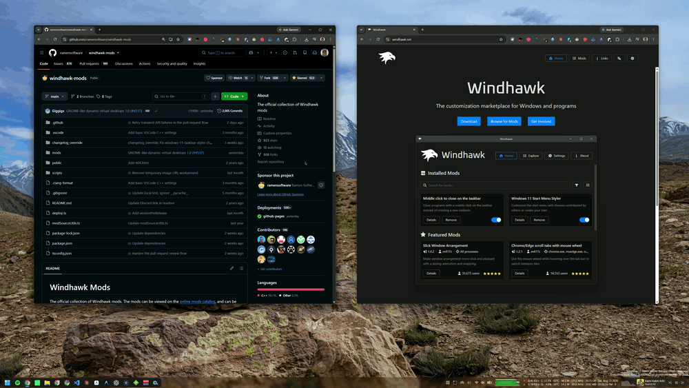
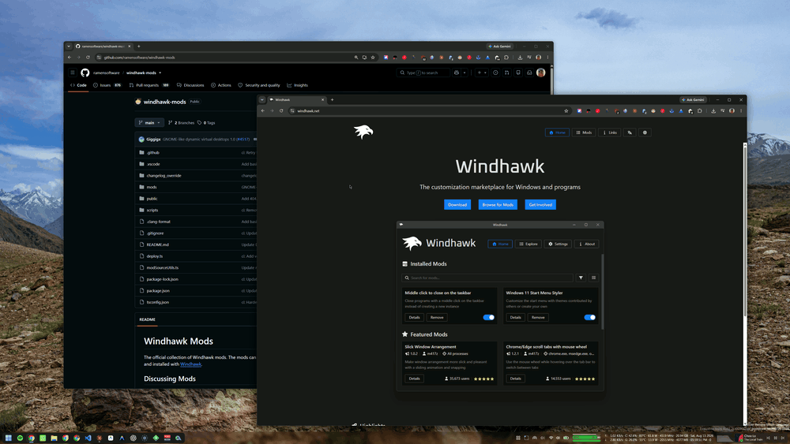
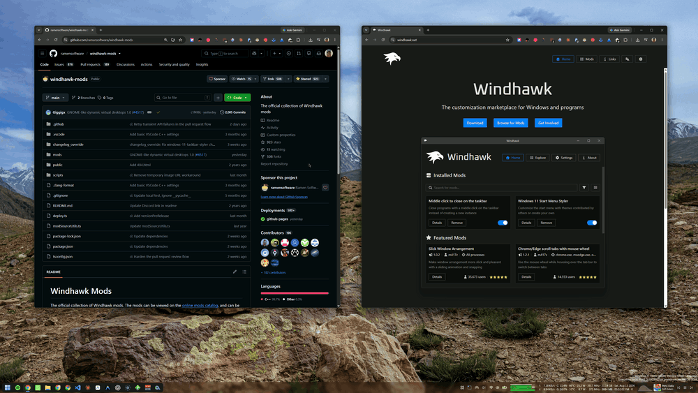
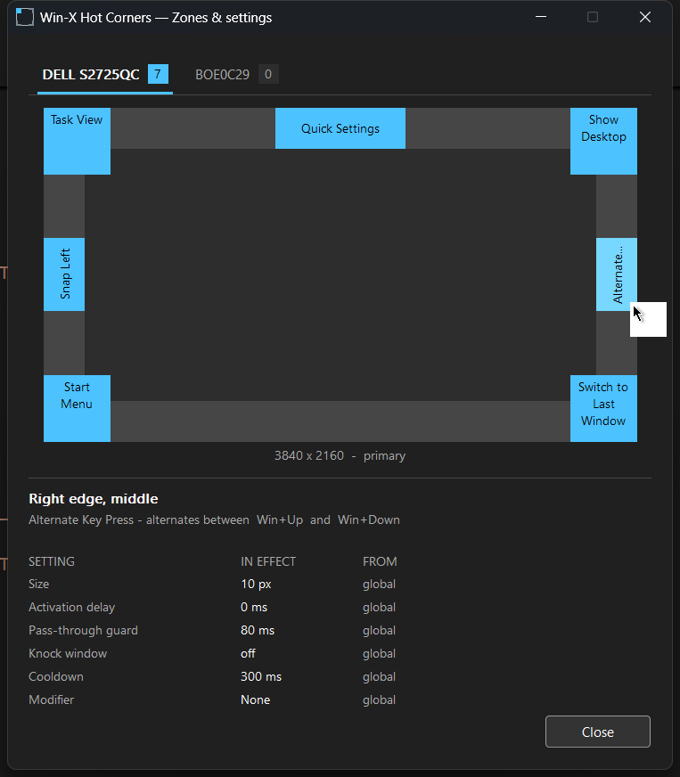

# Win-X Hot Corners

macOS-style hot corners **and screen edges** for Windows 10 and 11, with full
multi-monitor support. Built as a [Windhawk](https://windhawk.net) mod.

Throw the pointer into a corner or against an edge and something happens —
which corner, which edge, and what happens are all yours.

Inspired by [WinXCorners](https://github.com/vhanla/winxcorners), rebuilt from
scratch.

---

## Install

**From the Windhawk mod catalogue** — once
[ramensoftware/windhawk-mods#5001](https://github.com/ramensoftware/windhawk-mods/pull/5001)
is merged, this will be in Windhawk → **Explore** → search *Win-X Hot Corners*.
That is the route to use; Windhawk handles updates for you.

**Before then, or to run a local build:**

1. Install [Windhawk](https://windhawk.net/).
2. Windhawk → **Advanced** → **Development** → **Create a new mod**.
3. Replace the editor contents with
   [`win-x-hotcorners.wh.cpp`](win-x-hotcorners.wh.cpp) from this repo.
4. **Compile**, then enable it.

It runs as a *tool mod* — its own small process, not injected into Explorer or
any other application.

## What it does

- **16 zones per display** — four corners, and four edges split into three
  segments each. Give neighbouring segments the same action and they merge back
  into one edge-wide zone.
- **38 actions**, plus any key combination and any command you can name.
- **Five trigger styles** that combine: on arrival, after a dwell, on a double
  knock, only while a modifier is held, or press-and-hold to peek.
- **Per-monitor everything** — zones bind to a display's name, not its position,
  so rearranging screens never reshuffles your configuration.
- **No global mouse hook.** A dedicated thread samples the cursor instead, so
  games and applications keep their input path to themselves.

### The five trigger styles

| | |
|---|---|
| **Arrival** — reach the zone, it fires |  |
| **Dwell** — rest in it first |  |
| **Knock** — leave and come straight back |  |
| **Hold to peek** — one action on arrival, another on leaving |  |
| **With a modifier held** — inert unless Ctrl/Alt/Shift/Win is down |  |

Each gated style above shows the attempt that does *not* fire before the one
that does — that contrast is the point of the setting.

### Zones & settings

The tray icon's **Zones & settings** window is a read-only picture of what the
settings page produced: a tab per display, each zone's action drawn in place,
and the timings actually in effect for whichever zone you point at.

The full documentation — every action, the argument formats, multi-monitor
resolution, and the reasoning behind the design — lives in the mod's own readme,
which Windhawk renders on the mod page. It is the `==WindhawkModReadme==` block
at the top of
[`win-x-hotcorners.wh.cpp`](win-x-hotcorners.wh.cpp).

## Versions

This repository is the standalone home for the mod. The file here is kept in
sync with the copy submitted to the Windhawk catalogue.

Version numbering restarted at **1.0.0** when the mod was first submitted for
publication — the 4.x tags in this repository's history predate that and were
never released to anyone. See [CHANGELOG.md](CHANGELOG.md).

## Development

Day-to-day work happens in
[DhakadG/my-windhawk-mods](https://github.com/DhakadG/my-windhawk-mods), which
holds this mod alongside the others and carries the build and verification
tooling — a real clang type-check and link for x86, x86-64 and arm64, a settings
schema validator, and a local run of the Windhawk catalogue's own submission
checks.

[`docs/FEATURE-BACKLOG.md`](docs/FEATURE-BACKLOG.md) is a review of all 70
issues on the original WinXCorners tracker, grouped by whether they apply here.
It predates the 1.0 renumbering, so the action names in it are the old ones.

## Licence

[MIT](LICENSE).
